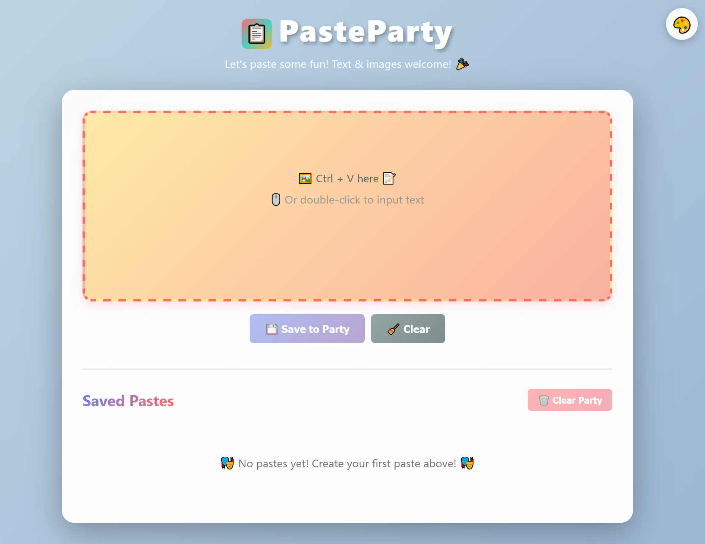

#  Paste Party 


An open source web app which offers easily accesible and persistant storage for text and images from your clipboard. Just paste and it's there when and where you need it!

## Screenshot



## Features

- ✅ **Paste text or images from clipboard** - Simply paste (Ctrl+V) any text or image content from your clipboard
- ✅ **Persistent storage** - All pastes are saved to the server and persistently displayed on the homepage
- ✅ **Copy pastes** - Copy any pasted content back to your clipboard (say, from another device)
- ✅ **Delete pastes** - Remove individual pastes or delete all at once
- ✅ **Random theme cycler** - Click the 🎨 button in the top right corner to randomly change the background color theme
- ✅ **Local network access** - Access from any device on your local network (requires firewall configuration). Advertises on 8081 by default.
- ✅ **Android Companion App** - Share text and images directly from your Android device to PasteParty via the Android share menu

## Installation

1. **Install Node.js** (if not already installed)
   - Download from https://nodejs.org/
   - Make sure npm is included

2. **Install dependencies**
   ```bash
   npm install
   ```

3. **Start the server**
   ```bash
   npm start
   ```

4. **Open your browser**
   - Navigate to http://localhost:8081
   - Paste text or images using Ctrl+V

## Usage

### Creating a Paste
1. Click in the paste area or press Ctrl+V
2. Paste your text or image
3. Click "💾 Save to Party" button
4. Your paste will appear in the list below

### Viewing Pastes
- All saved pastes are displayed on the homepage in a list
- Each paste shows a preview with its creation date
- Text pastes show the first 200 characters (but all content is saved)
- Image pastes show a thumbnail preview

### Managing Pastes
- **Copy**: Click "📋 Copy" on any paste to copy its content to clipboard
- **Delete**: Click "🗑️ Delete" on any paste to remove it
- **Delete All**: Click "🗑️ Clear Party" to remove all pastes at once

### Customizing Theme
- **Random Theme**: Click the 🎨 button in the top right corner to generate a new random pastel gradient background
- **Theme Persistence**: Your chosen theme is automatically saved to the server and will persist across page refreshes and different devices accessing the same server
- **Soft Colors**: Themes use modern, soft pastel colors for a pleasant visual experience

## Running as Windows Service

To run PasteParty as a Windows service (starts automatically on boot):

1. **Run the installation script as Administrator**
   ```powershell
   .\install-service.ps1
   ```

2. **Service Management Commands**
   ```powershell
   .\install-service.ps1 -Status    # Check service status
   .\install-service.ps1 -Start     # Start service
   .\install-service.ps1 -Stop      # Stop service
   .\install-service.ps1 -Uninstall # Remove service
   ```

   Or use Windows Services (`services.msc`) to manage the service.

## Exposing to Local Network (LAN)

To allow other devices on your local network to access PasteParty:

1. **Run the firewall configuration script as Administrator**
   ```powershell
   .\expose-to-lan.ps1
   ```

2. **The script will:**
   - Create a Windows Firewall rule to allow inbound connections on port 8081
   - Display your local IP address for network access
   - Configure access for both Domain and Private network profiles

3. **Access from other devices:**
   - Use the network IP address shown by the script (e.g., `http://192.168.1.100:8081`)
   - Or find your IP with: `ipconfig` in Command Prompt

4. **Remove firewall rule (if needed):**
   ```powershell
   .\expose-to-lan.ps1 -Remove
   ```

**Note:** This script only configures Windows Firewall. If you have other firewall software (Norton, McAfee, etc.), you may need to configure it separately.

## Android Companion App

PasteParty includes a companion Android app that allows you to share text and images directly from your Android device to your PasteParty server.

### Features
- 📱 **Share from any app** - Share text and images from Gallery, Chrome, Notes, or any app that supports sharing
- ⚙️ **Simple configuration** - Just set your PasteParty server URL once
- 🎯 **One-tap sharing** - Select "PasteParty Companion" from the Android share menu
- 📋 **Automatic posting** - Shared content automatically appears on your PasteParty homepage

### Installation Options

You have two options to get the Android app:

#### Option 1: Download Pre-built APK (Easiest)

1. **Download the latest release**
   - Go to [GitHub Releases](https://github.com/richard1912/PasteParty/releases)
   - Download `PasteParty-Companion-v1.0.0-debug.apk` from the latest release
   - Transfer the APK to your Android device

2. **Install on Android device**
   - Enable "Install from Unknown Sources" in your Android settings
   - Open the APK file and install it

#### Option 2: Build from Source

1. **Prerequisites**
   - Android Studio installed
   - Android SDK configured

2. **Build the APK**
   ```bash
   cd PasteParty-Companion
   ./gradlew assembleDebug
   ```
   The APK will be generated at: `app/build/outputs/apk/debug/app-debug.apk`

3. **Install on device**
   - Transfer the APK to your Android device
   - Install it (enable "Install from Unknown Sources" if needed)

### Configuration

1. **Configure Server URL**
   - Open the PasteParty Companion app on your device
   - Enter your PasteParty server URL (e.g., `http://192.168.1.100:8081`)
   - Make sure your server is running and accessible from your device
   - Tap "Save"

2. **Start Sharing**
   - Open any app (Gallery, Chrome, Notes, etc.)
   - Tap the share button
   - Select "PasteParty Companion" from the share menu
   - Your content will be sent to PasteParty automatically!

### Requirements
- Android 7.0 (API 24) or higher
- PasteParty server running and accessible from your device (same network or public IP)

See `PasteParty-Companion/README.md` for more technical details.

## Storage

Pastes are stored as JSON files in the `data/` directory. Each paste is saved with:
- Content (text or base64-encoded image)
- Type (text or image)
- Creation timestamp
- Unique ID (used internally for management)

Theme settings are stored in `data/settings.json` and persist across all sessions and devices accessing the same server.

## Technical Details

- **Port**: 8081 (default)
- **Backend**: Node.js with Express
- **Storage**: File-based (JSON files in `data/` directory)
- **Frontend**: Vanilla JavaScript with a colorful, modern UI
- **API**: RESTful API for paste operations

## API Endpoints

- `POST /api/paste` - Create a new paste
- `GET /api/pastes` - Get all pastes (displayed on homepage)
- `GET /api/paste/:id` - Get a specific paste (internal use for copy functionality)
- `DELETE /api/paste/:id` - Delete a specific paste
- `DELETE /api/pastes` - Delete all pastes
- `GET /api/settings/theme` - Get the current theme setting
- `POST /api/settings/theme` - Save a new theme setting

## Development

### Using push_updates.bat
- **Double-click** the file or run from command line
- **Follow prompts** for commit messages
- **Automatic handling** - Git add, commit, and push to develop branch

## Project Structure

```
PasteParty/
├── data/                 # Stored pastes (JSON files)
├── public/               # Frontend files
│   ├── index.html        # Main HTML file
│   ├── app.js           # Frontend JavaScript
│   └── style.css        # Styling
├── PasteParty-Companion/ # Android companion app
│   ├── app/             # Android app source code
│   └── README.md        # Android app documentation
├── server.js            # Express server
├── package.json         # Dependencies
├── push_updates.bat     # Git push automation
├── install-service.ps1  # Windows service installation
├── expose-to-lan.ps1    # LAN firewall configuration
└── README.md            # This file
```

## Requirements

- Node.js 14+
- npm (comes with Node.js)

## Repository Information

- **Repository URL**: https://github.com/richard1912/PasteParty.git
- **Current Branch**: develop

Happy pasting! 🎉📋
